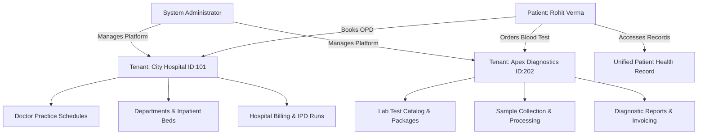
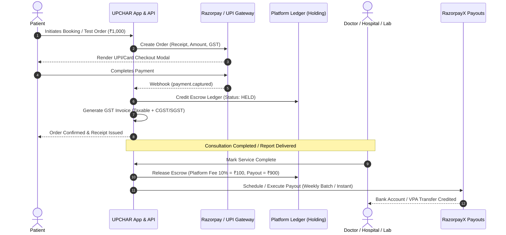

# UPCHAR Enterprise Healthcare SaaS Platform — System Architecture Document

**Document Version:** 1.0  
**Target Platform:** UPCHAR Multi-Tenant Healthcare SaaS  
**Author / System Architect:** Amit Kumar  
**Last Updated:** August 2026  
**Status:** Approved for Implementation  

---

## 1. System Overview & Technology Stack

UPCHAR is an enterprise-grade, multi-tenant healthcare SaaS platform designed to interconnect **Patients, Doctors, Hospitals, and Pathology/Diagnostic Laboratories** on a single unified data and payment engine.

```
+---------------------------------------------------------------------------------------+
|                                    UPCHAR PLATFORM                                    |
+---------------------------------------------------------------------------------------+
|  PATIENT PORTAL   |   DOCTOR PORTAL   |  HOSPITAL PORTAL  |    LAB PORTAL    | ADMIN  |
|  (B2B2C / Mobile) | (Practitioner Web)|    (B2B Tenant)   |   (B2B Tenant)   | (Ops)  |
+-------------------+-------------------+-------------------+------------------+--------+
|                                API GATEWAY / ROUTING LAYER                            |
|                     (Auth, CSRF, Rate Limiting, Tenant Scoping)                       |
+---------------------------------------------------------------------------------------+
|                                    CORE DOMAINS                                       |
|  [Appointments]  [E-Prescription]  [Pathology / LIS]  [Inpatient/Beds]  [Telehealth]  |
+---------------------------------------------------------------------------------------+
|                           UNIFIED PAYMENT & BILLING ENGINE                            |
|  [Payment Gateway]  [Escrow / Ledger]  [Payouts (RazorpayX)]  [GST Billing]  [SaaS]   |
+---------------------------------------------------------------------------------------+
|                                  DATA PERSISTENCE                                     |
|           MySQL Multi-Tenant (Row-Level Isolated) | S3/Local Encrypted Storage        |
+---------------------------------------------------------------------------------------+
```

### 1.1 Technology Stack Specifications
- **Backend Framework:** CodeIgniter MVC (PHP 7.4/8.x compatible) with PSR-compliant REST API controllers and middleware hooks.
- **Frontend / Client Layer:** HTML5, Modern Vanilla CSS3 Design System (HSL tokens, CSS Grid/Flexbox, responsive viewports: 375px, 768px, 1280px, 1920px), jQuery/AJAX, Bootstrap 3.4+ / Modern UI Shells.
- **Database Engine:** MySQL 8.0+ / MariaDB 10.4+ (InnoDB engine, utf8mb4 encoding, strict foreign key constraints, composite indexing on tenant keys).
- **Payment & Payout Gateway:** Razorpay Standard Gateway (Collections: UPI, Cards, Net Banking, EMI) + RazorpayX Payouts API (Automated doctor & tenant settlements).
- **Document & Media Storage:** Local file system (`admin1947/public/assets/upload/`) with absolute path hashing and S3/GCS migration-ready abstraction.
- **Security & Compliance:** ABDM (Ayushman Bharat Digital Mission) sandbox compatibility, PHI encryption at rest/transit, strict CSRF token validation, OWASP Top 10 mitigation.

---

## 2. Multi-Tenancy & Tenant Isolation Architecture

UPCHAR employs a **Shared Database, Shared Schema with Logical Row-Level Tenant Isolation** pattern. This maximizes cost efficiency, simplifies automated backups and migrations, and enables seamless cross-stakeholder workflows (e.g. a patient ordering tests from a tenant lab and consulting a doctor affiliated with multiple tenant hospitals).



### 2.1 Tenant Data Isolation Strategy
1. **Tenant Identification (`tenant_id` / `hospital_id` / `path_lab_id`):**
   - Every tenant entity (`hospital`, `pathlab`) has a globally unique primary key.
   - All tenant-owned records (`hospital_bed`, `admissions`, `department`, `path_lab_test`, `path_book`, `staff`, `invoices`) MUST carry explicit tenant foreign keys.
2. **Server-Side Query Scoping:**
   - Hospital and Lab panel controllers MUST automatically bind tenant ID from authenticated session (`$this->session->userdata('hospital_id')` or `$this->session->userdata('pathlab_id')`).
   - Direct record lookups (`GET /hospitalpanel/patient/{id}`) must verify `WHERE id = ? AND hospital_id = ?` to strictly prohibit cross-tenant IDOR (Insecure Direct Object Reference).
3. **Hybrid Diagnostic Lab Model (In-House vs. Standalone):**
   - **Standalone Lab Tenant:** Operates with its own `pathlab` record and dedicated subscription.
   - **In-House Hospital Lab:** Can be linked via `pathlab.hospital_id` to share billing ledgers while maintaining distinct diagnostic reporting workflows.
4. **Doctor Multi-Affiliation Model:**
   - A Doctor (`profile_dr`) maintains a single master profile.
   - Multi-hospital affiliations are managed in `dr_practice` with independent schedules (`timing`), consultation fees, and affiliation statuses per hospital tenant.

---

## 3. Unified Payment Management & Billing Engine

The payment engine governs all monetary flow across consultations, admissions, diagnostic tests, doctor payouts, and SaaS subscriptions.



### 3.1 Money Movement Matrix

| Transaction Type | Collection Point | Platform Fee / Split | Escrow Rule | Payout Timing |
|---|---|---|---|---|
| **Doctor OPD Consultation** | Upfront online or Pay-at-Clinic | 10% - 15% platform commission | Held until marked completed by doctor/patient | Weekly settlement (T+7 days) |
| **Pathology Lab Test** | Upfront online (Prepaid) | 12% - 18% commission | Held until lab report uploaded & verified | Weekly settlement |
| **Inpatient Admission Deposit** | At admission time | 0% - 5% processing fee | Direct hospital credit ledger | Real-time / Daily batch |
| **IPD Running Bed / OT Charges** | Cumulative billing at discharge | Net hospital invoice | Direct hospital billing | Settled with final bill |
| **SaaS Subscription (B2B)** | Recurring monthly / annual | 100% Platform Revenue | Direct platform bank capture | Immediate |

### 3.2 Double-Entry Ledger Schema
Every financial transaction logs two balancing entries:
- **Debit Entry:** Source account (e.g. `PATIENT_PAYMENT_WALLET`, `PLATFORM_ESCROW`)
- **Credit Entry:** Destination account (e.g. `DOCTOR_PAYABLE`, `HOSPITAL_PAYABLE`, `PLATFORM_REVENUE`)
- **Immutable Log:** Financial entries can never be `UPDATED` or `DELETED`; adjustments require compensatory credit/debit adjustment transactions with reference notes.

---

## 4. Comprehensive Database Schema & Entity Relationships

### 4.1 Master Entity Relationship (Core Tables)

```
 [userlogin (Patients)]
         | (1:N)
         +---> [appointment] <--- (1:N) --- [profile_dr (Doctors)]
         |           | (1:1)                      | (1:N)
         |     [sm_order] <---------------- [dr_practice]
         |           | (1:1)                      | (M:1)
         |     [payment_ledger]              [hospital (Tenants)]
         |                                        | (1:N)
         +---> [path_book] <----------------- [pathlab (Tenants)]
                     | (1:N)                      | (1:N)
               [path_book_test] <----------- [path_lab_test]
```

### 4.2 Core Tables & Extensions

#### `tenants` (B2B SaaS Tenant Management)
```sql
CREATE TABLE IF NOT EXISTS `saas_tenants` (
  `id` INT(11) UNSIGNED AUTO_INCREMENT PRIMARY KEY,
  `tenant_type` ENUM('HOSPITAL', 'PATHLAB', 'CLINIC') NOT NULL,
  `tenant_id` INT(11) UNSIGNED NOT NULL COMMENT 'FK to hospital.id or pathlab.id',
  `plan_id` INT(11) UNSIGNED NOT NULL,
  `subscription_status` ENUM('TRIAL', 'ACTIVE', 'PAST_DUE', 'CANCELLED') DEFAULT 'TRIAL',
  `trial_ends_at` DATETIME NULL,
  `current_period_start` DATETIME NOT NULL,
  `current_period_end` DATETIME NOT NULL,
  `max_doctors` INT(11) DEFAULT 10,
  `max_staff` INT(11) DEFAULT 25,
  `max_storage_mb` INT(11) DEFAULT 5120,
  `created_at` TIMESTAMP DEFAULT CURRENT_TIMESTAMP,
  `updated_at` TIMESTAMP DEFAULT CURRENT_TIMESTAMP ON UPDATE CURRENT_TIMESTAMP,
  INDEX `idx_tenant_lookup` (`tenant_type`, `tenant_id`)
) ENGINE=InnoDB DEFAULT CHARSET=utf8mb4;
```

#### `saas_plans` (Tiered B2B Pricing)
```sql
CREATE TABLE IF NOT EXISTS `saas_plans` (
  `id` INT(11) UNSIGNED AUTO_INCREMENT PRIMARY KEY,
  `name` VARCHAR(100) NOT NULL COMMENT 'Basic, Growth, Enterprise',
  `code` VARCHAR(50) UNIQUE NOT NULL,
  `monthly_price` DECIMAL(10,2) NOT NULL,
  `annual_price` DECIMAL(10,2) NOT NULL,
  `feature_flags` JSON COMMENT 'Enabled modules: telemetry, ipd, lab, erp',
  `status` ENUM('ACTIVE', 'INACTIVE') DEFAULT 'ACTIVE',
  `created_at` TIMESTAMP DEFAULT CURRENT_TIMESTAMP
) ENGINE=InnoDB DEFAULT CHARSET=utf8mb4;
```

#### `financial_ledger` (Double-Entry Financial Transactions)
```sql
CREATE TABLE IF NOT EXISTS `financial_ledger` (
  `id` BIGINT(20) UNSIGNED AUTO_INCREMENT PRIMARY KEY,
  `transaction_ref` VARCHAR(64) UNIQUE NOT NULL,
  `order_id` VARCHAR(50) NULL COMMENT 'FK to sm_order.ORDER_ID',
  `payer_type` ENUM('PATIENT', 'PLATFORM', 'TENANT') NOT NULL,
  `payer_id` INT(11) UNSIGNED NOT NULL,
  `payee_type` ENUM('PLATFORM', 'DOCTOR', 'HOSPITAL', 'PATHLAB') NOT NULL,
  `payee_id` INT(11) UNSIGNED NOT NULL,
  `gross_amount` DECIMAL(10,2) NOT NULL,
  `platform_fee` DECIMAL(10,2) DEFAULT 0.00,
  `tax_amount` DECIMAL(10,2) DEFAULT 0.00,
  `net_payout` DECIMAL(10,2) NOT NULL,
  `currency` VARCHAR(3) DEFAULT 'INR',
  `escrow_status` ENUM('HELD', 'RELEASED', 'REFUNDED', 'DISPUTED') DEFAULT 'HELD',
  `payout_batch_id` VARCHAR(64) NULL,
  `payout_status` ENUM('UNPROCESSED', 'QUEUED', 'PROCESSED', 'FAILED') DEFAULT 'UNPROCESSED',
  `gateway_payment_id` VARCHAR(100) NULL,
  `created_at` TIMESTAMP DEFAULT CURRENT_TIMESTAMP,
  INDEX `idx_payee` (`payee_type`, `payee_id`, `payout_status`),
  INDEX `idx_order` (`order_id`)
) ENGINE=InnoDB DEFAULT CHARSET=utf8mb4;
```

#### `admissions_ipd` (Hospital Inpatient Management)
```sql
CREATE TABLE IF NOT EXISTS `hospital_admissions` (
  `id` INT(11) UNSIGNED AUTO_INCREMENT PRIMARY KEY,
  `hospital_id` INT(11) UNSIGNED NOT NULL,
  `patient_id` INT(11) UNSIGNED NOT NULL,
  `attending_doctor_id` INT(11) UNSIGNED NOT NULL,
  `bed_id` INT(11) UNSIGNED NOT NULL,
  `admission_number` VARCHAR(50) UNIQUE NOT NULL,
  `admission_date` DATETIME NOT NULL,
  `discharge_date` DATETIME NULL,
  `admission_reason` TEXT,
  `deposit_amount` DECIMAL(10,2) DEFAULT 0.00,
  `current_running_bill` DECIMAL(10,2) DEFAULT 0.00,
  `status` ENUM('ADMITTED', 'TRANSFERRED', 'DISCHARGED', 'CANCELLED') DEFAULT 'ADMITTED',
  `created_at` TIMESTAMP DEFAULT CURRENT_TIMESTAMP,
  INDEX `idx_hospital_patients` (`hospital_id`, `status`)
) ENGINE=InnoDB DEFAULT CHARSET=utf8mb4;
```

#### `prescriptions_soap` (Structured Clinical Notes & E-Prescriptions)
```sql
CREATE TABLE IF NOT EXISTS `prescriptions` (
  `id` INT(11) UNSIGNED AUTO_INCREMENT PRIMARY KEY,
  `appointment_id` INT(11) UNSIGNED NOT NULL,
  `patient_id` INT(11) UNSIGNED NOT NULL,
  `doctor_id` INT(11) UNSIGNED NOT NULL,
  `hospital_id` INT(11) UNSIGNED NULL,
  `symptoms_subjective` TEXT,
  `examination_objective` TEXT,
  `diagnosis_assessment` TEXT NOT NULL,
  `treatment_plan` TEXT NOT NULL,
  `medications_json` JSON NOT NULL COMMENT '[{medicine, dosage, frequency, duration, instructions}]',
  `lab_tests_recommended` JSON NULL,
  `followup_date` DATE NULL,
  `pdf_url` VARCHAR(255) NULL,
  `created_at` TIMESTAMP DEFAULT CURRENT_TIMESTAMP,
  INDEX `idx_patient_records` (`patient_id`, `created_at`),
  INDEX `idx_doctor_prescriptions` (`doctor_id`)
) ENGINE=InnoDB DEFAULT CHARSET=utf8mb4;
```

---

## 5. Stakeholder Dashboard Functional Architecture

### 5.1 Patient Dashboard (`/myappointments`, `/mytest`, `/profile`)
- **Appointment Lifecycle:** Search by Doctor / Specialty / Location -> Select slot / mode (In-Clinic or Video) -> Instant OTP verification -> Razorpay checkout -> Confirmation badge.
- **Pathology Catalog & Home Sample:** Search diagnostic tests -> Add to Cart -> Select Home Collection (Address & Timeslot) or Walk-in -> Receive tracking updates -> Access & download PDF lab reports.
- **Family Profiles:** Manage primary account + multiple dependents (spouse, children, parents) with isolated medical histories.
- **Telemedicine WebRTC Room:** One-click launch with encrypted token verification, live in-call text chat, and instant digital prescription delivery.

### 5.2 Doctor Dashboard (`/doctorpanel`)
- **Dynamic Multi-Hospital Schedule Engine:** Configure practice days (`M`, `T`, `W`, `TH`, `F`, `SA`, `S`), time windows, and slot durations independently per hospital / clinic.
- **Structured SOAP Consultation & Rx:** Autocomplete medicine search from master drug index, structured dosage regimens (e.g. `1-0-1 after meals for 5 days`), and auto-compiled digital prescription with signature.
- **Financial Earnings & Settlements:** Live earnings counter (Today, This Week, This Month), pending escrow releases, and downloadable tax deduction statements.

### 5.3 Hospital Admin Dashboard (`/hospitalpanel`)
- **Staff & RBAC Administration:** Role assignment (`Hospital Admin`, `Receptionist`, `Doctor`, `Nurse`, `Billing Officer`).
- **Inpatient & Bed Matrix:** Live floor visualizer showing bed status (`OCCUPIED`, `VACANT`, `CLEANING`, `MAINTENANCE`), daily bed charges, and transfer workflows.
- **Running Inpatient Billing:** Auto-accumulates daily bed charges, lab investigations, doctor visit charges, and surgical fees into a consolidated discharge invoice with split payment support (Cash, Card, TPA Insurance).

### 5.4 Pathology / Diagnostic Lab Dashboard (`/pathlabpanel`)
- **Test Catalog & Pricing:** Custom test creation with sample types (Blood, Urine, Serum, Swab), standard turnaround time (TAT in hours), and normal reference ranges.
- **LIS Order Pipeline:** 4-Stage Kanban Workflow:
  1. `ORDERED` (New booking received)
  2. `COLLECTED` (Phlebotomist collected sample / Barcode assigned)
  3. `PROCESSING` (Under analyzer evaluation)
  4. `COMPLETED / REPORT ISSUED` (Structured parameter values entered + PDF validated)
- **Automated Patient & Doctor Notification:** Webhook / SMS dispatch with direct report download links upon result verification.

### 5.5 System Admin Dashboard (`/admin1947`)
- **Tenant Lifecycle Operations:** Approve, onboard, suspend, or upgrade Hospital and Lab tenants.
- **SaaS Subscription Billing:** View recurring billing runs, handle failed renewal dunning cycles, and monitor churn.
- **Platform Settlement Clearinghouse:** Trigger weekly batch doctor and tenant payouts via RazorpayX with full transaction ledger verification.
- **Global Compliance & Audit Trails:** Searchable activity logs for all PHI reads, user access, and financial movements.

---

## 6. Security, Compliance & Non-Functional Specifications

```
+-----------------------------------------------------------------------------------+
|                            SECURITY & COMPLIANCE MATRIX                           |
+-----------------------------------------------------------------------------------+
| 1. DATA AT REST        | AES-256 encrypted database columns for PHI               |
| 2. DATA IN TRANSIT     | Strict TLS 1.3 encryption across all HTTP endpoints      |
| 3. AUTHENTICATION      | Bcrypt password hashing (Cost 12), Role-isolated sessions|
| 4. CARD DATA (PCI-DSS) | ZERO raw card storage. 100% tokenized via Razorpay       |
| 5. ACCESS CONTROL      | Server-side tenant scoping & RBAC enforcement            |
| 6. CSRF PROTECTION     | Synchronizer Token Pattern on all POST/PUT requests      |
+-----------------------------------------------------------------------------------+
```

- **Availability Target:** 99.5% Uptime with automated database snapshot backups.
- **Performance Budget:** Server response time `< 400ms` on TTFB; complete page rendering `< 2.0s`.
- **Accessibility:** WCAG 2.1 Level AA compliant contrast ratios and keyboard navigability.
