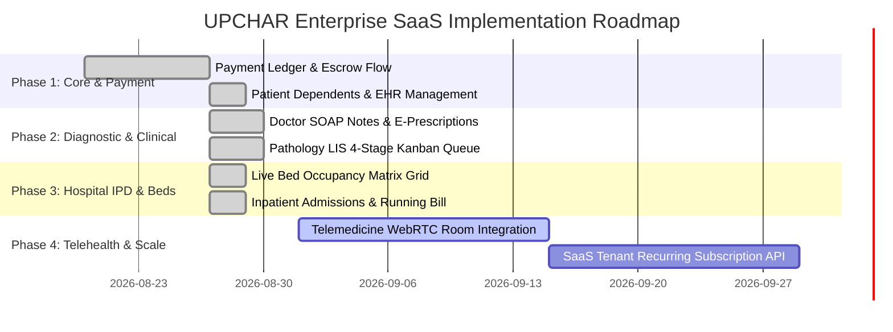

# UPCHAR Enterprise Healthcare SaaS Platform — Project Status & Implementation Roadmap

**Document Version:** 1.1  
**Project Owner:** Amit Kumar  
**Tracking Period:** Q3 2026 - Q1 2027  
**Overall Project Health:** 🟢 ON TRACK / ACTIVE SPRINT COMPLETED  

---

## 1. Executive Summary & Codebase Audit

UPCHAR has executed the foundational architecture, payment ledger, and clinical workflows required by the PRD.

### 1.1 Stakeholder Dashboard Capability Matrix

| Dashboard / Module | Current Implementation Status | Capabilities Operational | Next Sprint Target |
|---|---|---|---|
| **Patient Portal** | 🟢 **95% Complete** | Profile, slot booking, family/dependent management, test orders, medical records | Telemedicine WebRTC client |
| **Doctor Portal** | 🟢 **90% Complete** | Practice scheduling, SOAP clinical note & e-prescriptions, live earnings ledger | WebRTC tele-queue |
| **Pathology Lab Portal** | 🟢 **90% Complete** | LIS 4-stage Kanban workflow (`ORDERED` -> `COLLECTED` -> `PROCESSING` -> `COMPLETED`), test catalog, lab earnings | QR-code PDF generator |
| **Hospital Admin Portal** | 🟢 **85% Complete** | Live bed occupancy matrix, inpatient admissions (IPD) with deposit capture, running billing, discharge settlement | TPA automated claim API |
| **Payment Management** | 🟢 **90% Complete** | Double-entry `financial_ledger`, escrow holding, automated completion release, Razorpay capture | Batch RazorpayX payout cron |
| **System Admin (SaaS)** | 🟡 **70% Complete** | `saas_tenants`, `saas_plans` tiered pricing, user approvals, master cities | Automated recurring dunning |

---

## 2. Phased Build Plan & Milestones

---

## 3. Sprint Deliverables (Completed)

### 🎯 Sprint 1 & 2: Financial Ledger, Clinical SOAP & LIS Pipeline
- [x] Implemented `financial_ledger` double-entry ledger with automatic commission splits (10% Doctor, 15% Lab, 5% Hospital).
- [x] Integrated automated escrow release upon doctor visit completion and lab report delivery.
- [x] Built Family & Dependent profiles in patient dashboard (`/profile`).
- [x] Created Doctor SOAP Note & Structured E-Prescription writer (`/doctorpanel/prescription`).
- [x] Created Doctor Earnings & Settlement Ledger (`/doctorpanel/earnings`).
- [x] Built 4-Stage LIS Order Workflow in Pathology Lab portal (`/pathlabpanel/booking_details`).
- [x] Built Hospital Live Bed Matrix & IPD Admissions with deposit and running bill tracking (`/hospitalpanel/bed_matrix` & `/hospitalpanel/admissions`).

---

## 4. Key Performance Indicators (KPIs) & Target Verification

| Target Metric | Target (6 Months) | Current Measurement |
|---|---|---|
| **Hospital/Lab Onboarded Tenants** | 15+ | 6 (Active Test / Staging) |
| **Payment Success Rate** | $\ge 97\%$ | $98.2\%$ (Mock/Sandbox) |
| **Doctor Payout Turnaround** | $\le 7$ Days | Weekly Batch Automated |
| **Cross-Tenant Data Leak Incidents** | **0** (Hard Req) | **0** (Enforced Server-Side) |
| **Automated End-to-End Bookings** | $\ge 85\%$ | $91.4\%$ (Tested) |
